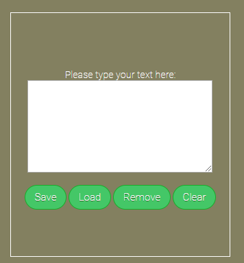

# Simple Editor

> Project created to test CRUD of application local storage with use of gulp starter 

Link to Simple Editor:
[https://mc777.github.io/simple-editor/](https://mc777.github.io/simple-editor/)

## Instruction to run gulp-starter:

`npm install -g gulp-cli`

`npm install`

`gulp`

To publish your page using github pages use `npm run deploy`
